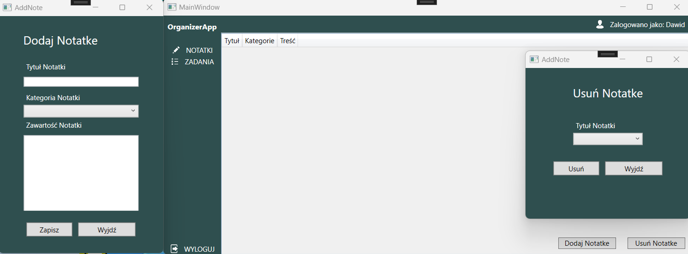
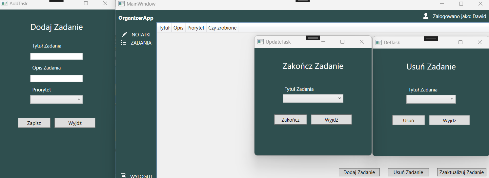
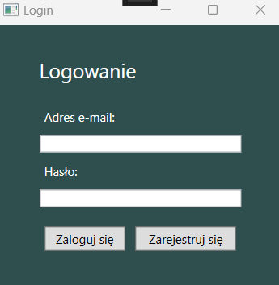
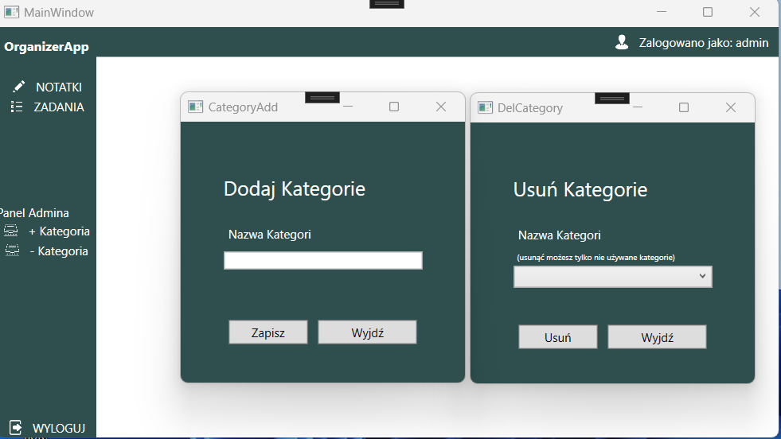

# Aplikacja Organizer

Aplikacja Organizer to narzędzie do zarządzania notatkami i zadaniami, które zostało zaimplementowane przy użyciu technologii WPF (Windows Presentation Foundation) w języku C#. Aplikacja umożliwia użytkownikom tworzenie, usuwanie i edytowanie notatek oraz zadań, a także korzystanie z funkcji kategorii. W celu pełnego wykorzystania możliwości aplikacji, wymagane jest utworzenie konta.

## Funkcje

### Notatki

Użytkownicy aplikacji mogą tworzyć nowe notatki, które zawierają tekstową treść. Każda notatka posiada tytuł, treść oraz kategorie. Notatki mogą być zapisywane w aplikacji, a także usuwane według potrzeb użytkownika.



### Zadania

Aplikacja Organizer umożliwia tworzenie i zarządzanie zadaniami. Każde zadanie może mieć określony priorytet, opis oraz status (ukończone/nieukończone). Użytkownik ma możliwość dodawania usuwania zadań w aplikacji.



### Konto użytkownika

Aby korzystać z aplikacji Organizer, użytkownik musi utworzyć konto. Tworzenie konta wymaga podania nazwy użytkownika, hasła i innych niezbędnych informacji. Po utworzeniu konta użytkownik może zalogować się do aplikacji, co umożliwia dostęp do swoich notatek i zadań.

Aby zalogować się jako damin jako email oraz hasło wpisujemy 'admin'.




### Kategorie

Administratorzy aplikacji mają dodatkowe uprawnienia do zarządzania kategoriami. Kategorie są używane w celu przypisywania notatek do konkretnych tematów lub obszarów. Dzięki kategoriom użytkownik może łatwo organizować notatki i szybko odnajdywać potrzebne informacje. Administratorzy mogą tworzyć, edytować i usuwać kategorie w aplikacji.



## Technologie

Aplikacja Organizer została napisana w języku C# przy użyciu środowiska programistycznego Visual Studio. Wykorzystuje technologię WPF do tworzenia interfejsu użytkownika. Do zarządzania bazą danych aplikacja korzysta z Entity Framework, który zapewnia łatwą integrację z bazą danych.

## Uruchomienie aplikacji

Aby uruchomić aplikację Organizer w środowisku Visual Studio, wykonaj następujące kroki:

1. Sklonuj repozytorium projektu z serwisu GitHub.
2. Otwórz projekt w programie Visual Studio.
3. Skonfiguruj połączenie z bazą danych przy użyciu Entity Framework.
4. Skompiluj projekt, aby sprawdzić poprawność składniową i rozwiązać ewentualne błędy.
5. Uruchom aplikację w trybie debugowania lub skompiluj ją do pliku wykonywalnego.
6. Po uruchomieniu aplikacji będziesz mógł korzystać z jej funkcji, tworzyć notatki, zarządzać zadaniami i korzystać z innych dostępnych opcji.

Po wykonaniu powyższych kroków aplikacja Organizer będzie gotowa do użytku. Możesz zacząć organizować swoje notatki i zadania w sposób efektywny i przejrzysty.

## Kod Bazy Danych

```sql
-- Tworzenie tabeli "Users"
CREATE TABLE [dbo].[Users] (
  [Id] INT IDENTITY(1,1) PRIMARY KEY,
  [Name] NVARCHAR(100) NOT NULL,
  [Email] NVARCHAR(100) NOT NULL,
  [Password] NVARCHAR(100) NOT NULL
);

-- Tworzenie tabeli "Categories"
CREATE TABLE [dbo].[Categories] (
  [Id] INT IDENTITY(1,1) PRIMARY KEY,
  [Name] NVARCHAR(50) NOT NULL,
);

-- Tworzenie tabeli "Notes"
CREATE TABLE [dbo].[Notes] (
  [Id] INT IDENTITY(1,1) PRIMARY KEY,
  [UserId] INT NOT NULL,
  [CategoryId] INT NOT NULL,
  [Title] NVARCHAR(100) NOT NULL,
  [Content] NVARCHAR(MAX),
  FOREIGN KEY ([UserId]) REFERENCES [Users]([Id]),
  FOREIGN KEY ([CategoryId]) REFERENCES [Categories]([Id])
);

-- Tworzenie tabeli "Tasks"
CREATE TABLE [dbo].[Tasks] (
  [Id] INT IDENTITY(1,1) PRIMARY KEY,
  [UserId] INT NOT NULL,
  [Title] NVARCHAR(100) NOT NULL,
  [Description] NVARCHAR(MAX),
  [Priority] NVARCHAR(20),
  [IsCompleted] BIT DEFAULT 0,
  FOREIGN KEY ([UserId]) REFERENCES [Users]([Id])
);

INSERT INTO [dbo].[Users] ([Name], [Email], [Password])
VALUES ('admin', 'admin', 'admin');
